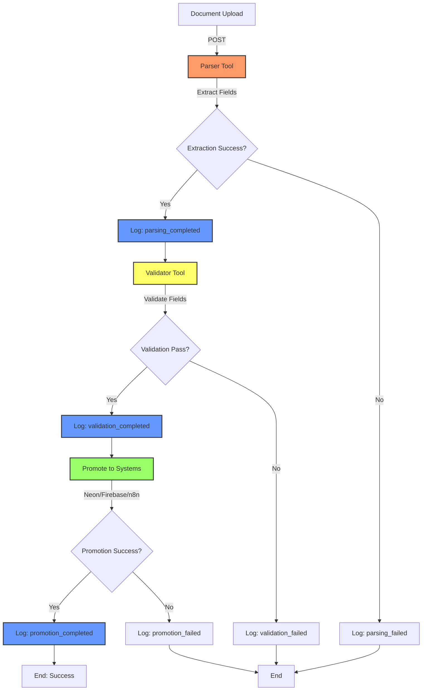
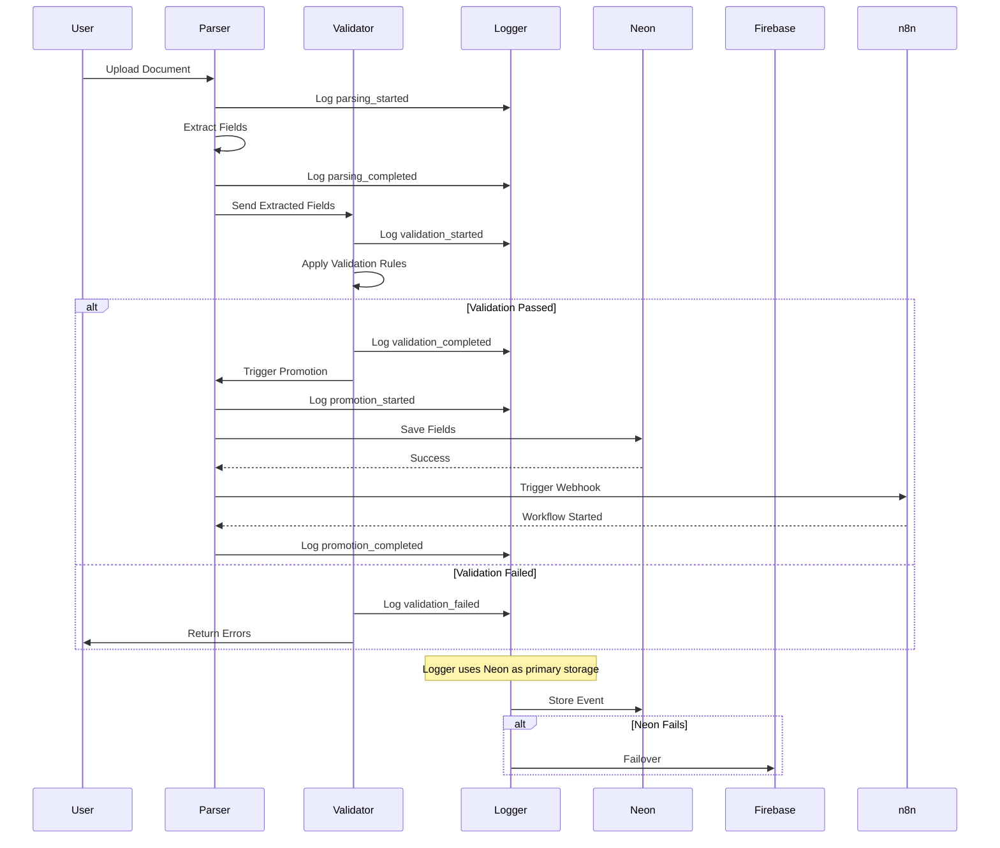
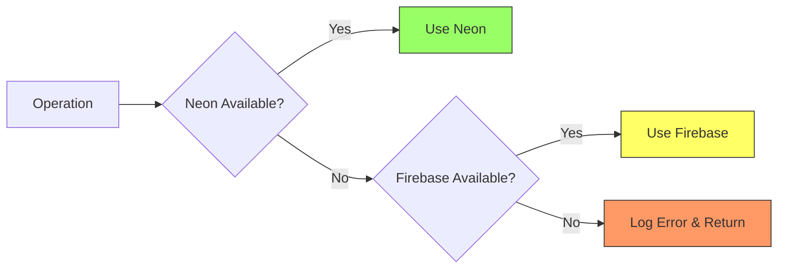

# Barton Toolbox Hub - Documentation

**Branch:** `tool/documentation`
**Version:** 1.0.0
**Last Updated:** 2024-11-12

## Overview

The Barton Toolbox Hub is a modular process management platform that coordinates document processing workflows through a hub-and-spoke architecture. Each tool is self-contained and can be deployed independently or as part of the integrated system.

## Architecture

### Hub-and-Spoke Model

```
                    ┌─────────────────────┐
                    │  Barton Toolbox Hub │
                    │   (Main Platform)   │
                    └──────────┬──────────┘
                               │
                ┌──────────────┼──────────────┐
                │              │              │
           ┌────▼────┐    ┌───▼────┐    ┌───▼────┐
           │ Parser  │    │Validator│   │ Logger │
           │  Tool   │    │  Tool   │   │  Tool  │
           └─────────┘    └─────────┘    └────────┘
```

Each tool ("spoke") can be:
- Cloned from templates
- Deployed independently
- Integrated with the hub
- Customized for specific processes

## Tools Overview

### 1. Parser Tool

**Branch:** `tool/parser`
**Location:** `/backend/tools/parser`

Provides OCR and field extraction capabilities.

**Key Features:**
- DeepSeek-OCR integration
- 5 extraction patterns (colon, equals, dollar, table, date)
- 150+ field mappings
- Confidence scoring (0.0-1.0)
- Multi-destination promotion (Neon, Firebase, n8n)

**API Endpoints:**
- `POST /api/parser/extract` - Extract fields from text
- `POST /api/parser/promote` - Promote to external systems
- `GET /api/parser/health` - Health check
- `GET /api/parser/mappings` - Get field mappings

**See:** `/backend/tools/parser/README.md`

### 2. Validator Tool

**Branch:** `tool/validator`
**Location:** `/backend/tools/validator`

Validates document fields against defined schemas and rules.

**Key Features:**
- 8 validation rule types (required, type, range, regex, length, enum, date_format, custom)
- Severity levels (error, warning, info)
- Schema-based validation (JSON configs)
- Batch validation support
- 95%+ test coverage

**API Endpoints:**
- `POST /api/validator/validate` - Validate fields
- `POST /api/validator/validate/batch` - Batch validation
- `GET /api/validator/schemas` - List schemas
- `GET /api/validator/schemas/{id}` - Get schema details
- `GET /api/validator/health` - Health check

**See:** `/backend/tools/validator/README.md`

### 3. Logger Tool

**Branch:** `tool/logger`
**Location:** `/backend/tools/logger`

Event logging with Neon/Firebase failover.

**Key Features:**
- Neon (PostgreSQL) primary storage
- Firebase (Firestore) automatic failover
- Event levels (debug, info, warning, error, critical)
- Rich metadata (JSONB)
- SQL views and functions

**API Endpoints:**
- `POST /api/logger/event` - Log event
- `POST /api/logger/events/batch` - Batch logging
- `GET /api/logger/events/{doc_id}` - Get events by document
- `GET /api/logger/statistics` - Get statistics
- `GET /api/logger/health` - Health check

**See:** `/backend/tools/logger/README.md`

## Processing Pipeline

### Complete Document Processing Flow



### Step-by-Step Process

#### Step 1: Document Upload & Parsing

```
User/System → POST /api/parser/extract
    ├─ Log: parsing_started
    ├─ DeepSeek-OCR processes PDF
    ├─ Field extraction (5 patterns)
    ├─ Confidence scoring
    ├─ Field mapping (150+ mappings)
    └─ Log: parsing_completed / parsing_failed
```

**Output:**
```json
{
  "doc_id": "doc_001",
  "fields": {
    "policy_number": {"value": "ABC123", "confidence": 0.95},
    "stop_loss_deductible": {"value": 50000, "confidence": 0.90}
  },
  "field_count": 25,
  "confidence_avg": 0.92
}
```

#### Step 2: Field Validation

```
Parser Output → POST /api/validator/validate
    ├─ Log: validation_started
    ├─ Load schema (document_basic, financial_fields, etc.)
    ├─ Apply rules:
    │   ├─ Required fields check
    │   ├─ Type validation
    │   ├─ Range validation
    │   ├─ Regex patterns
    │   └─ Custom rules
    └─ Log: validation_completed / validation_failed
```

**Output:**
```json
{
  "valid": true,
  "errors": [],
  "warnings": ["Optional field 'tpa_name' missing"],
  "summary": {
    "total_errors": 0,
    "total_warnings": 1,
    "rules_checked": 15
  }
}
```

#### Step 3: Data Promotion

```
Validated Fields → POST /api/parser/promote
    ├─ Log: promotion_started
    ├─ Promote to Neon (PostgreSQL)
    ├─ Promote to Firebase (optional)
    ├─ Trigger n8n webhook
    └─ Log: promotion_completed / promotion_failed
```

**Output:**
```json
{
  "success": true,
  "results": {
    "neon": {"success": true, "row_id": 12345},
    "n8n": {"success": true, "workflow_id": "wf_789"}
  }
}
```

#### Step 4: Event Logging (Throughout)

```
All Steps → POST /api/logger/event
    ├─ Event data to Neon (primary)
    ├─ Failover to Firebase if Neon fails
    └─ Store: event_type, doc_id, message, level, metadata
```

**Events Logged:**
- `parsing_started`, `parsing_completed`, `parsing_failed`
- `validation_started`, `validation_completed`, `validation_failed`
- `promotion_started`, `promotion_completed`, `promotion_failed`
- Custom events as needed

## Data Flow Diagram



## System Integration

### Tool Communication

Tools communicate via:
1. **REST API** - HTTP/JSON between tools
2. **Shared Database** - Neon for data storage
3. **Event Logging** - Centralized logger for audit trail
4. **Webhooks** - n8n for workflow automation

### Environment Configuration

Each tool has its own `.env` file:

```
/backend/tools/parser/.env
/backend/tools/validator/.env
/backend/tools/logger/.env
```

**Shared Variables:**
- `NEON_URL` - PostgreSQL connection
- `FIREBASE_CREDENTIALS` - Firebase config
- `N8N_DOC_WEBHOOK_URL` - n8n webhook

### Database Schema

**Neon Tables:**
- `doc_parser_fillable` - Parsed document fields (Parser)
- `doc_event_log` - Event audit trail (Logger)

**Firebase Collections:**
- `doc_parser_fillable` - Mirror of Neon table (Parser failover)
- `doc_event_log` - Mirror of event log (Logger failover)

## Error Handling

### Failover Strategy



### Error Event Logging

All errors are logged with:
- `event_type`: specific error type
- `level`: `error` or `critical`
- `metadata`: error details, stack traces, context

**Example:**
```json
{
  "event_type": "parsing_failed",
  "doc_id": "doc_001",
  "message": "Failed to extract fields: Invalid PDF format",
  "level": "error",
  "metadata": {
    "error_code": "PDF_001",
    "error_details": "...",
    "pdf_size": 125000,
    "attempted_at": "2024-11-12T12:00:00Z"
  }
}
```

## Deployment

### Individual Tool Deployment

Each tool can be deployed independently:

```bash
# Deploy parser only
cd backend/tools/parser
pip install -r requirements.txt
uvicorn routes:router --host 0.0.0.0 --port 8001

# Deploy validator only
cd backend/tools/validator
pip install -r requirements.txt
uvicorn routes:router --host 0.0.0.0 --port 8002

# Deploy logger only
cd backend/tools/logger
pip install -r requirements.txt
uvicorn routes:router --host 0.0.0.0 --port 8003
```

### Integrated Hub Deployment

Deploy all tools together:

```python
# backend/main.py
from fastapi import FastAPI
from backend.tools.parser import router as parser_router
from backend.tools.validator import router as validator_router
from backend.tools.logger import router as logger_router

app = FastAPI(title="Barton Toolbox Hub")

# Register all tools
app.include_router(parser_router)
app.include_router(validator_router)
app.include_router(logger_router)

# Run: uvicorn main:app --host 0.0.0.0 --port 8000
```

## Tool Templates

Each tool follows the same template structure:

```
/backend/tools/{tool_name}/
├── core/                    # Core business logic
│   ├── {module}.py
│   └── __init__.py
├── schemas/                 # Validation schemas (validator only)
├── sql/                     # Database schemas (reference)
├── tests/                   # Unit tests
├── routes.py                # FastAPI endpoints
├── __init__.py
├── .env.example             # Environment template
├── requirements.txt         # Python dependencies
└── README.md                # Documentation
```

### Creating a New Tool

1. **Clone a tool template:**
   ```bash
   git checkout tool/parser  # or validator, logger
   git checkout -b tool/my_new_tool
   ```

2. **Customize for your process:**
   - Update `routes.py` with new endpoints
   - Add business logic to `core/`
   - Create SQL schema if needed
   - Write tests
   - Update README

3. **Register with hub:**
   ```python
   from backend.tools.my_new_tool import router as my_tool_router
   app.include_router(my_tool_router)
   ```

## API Overview

See [API_OVERVIEW.md](API_OVERVIEW.md) for complete endpoint documentation.

### Quick Reference

| Tool      | Base Path          | Key Endpoints                                      |
|-----------|--------------------|----------------------------------------------------|
| Parser    | `/api/parser`      | `/extract`, `/promote`, `/health`                  |
| Validator | `/api/validator`   | `/validate`, `/schemas`, `/health`                 |
| Logger    | `/api/logger`      | `/event`, `/events/{doc_id}`, `/statistics`        |

## Development

### Running Tests

```bash
# Test individual tools
pytest backend/tools/parser/tests/ -v
pytest backend/tools/validator/tests/ -v
pytest backend/tools/logger/tests/ -v

# Test all tools
pytest backend/tools/ -v --cov=backend.tools
```

### Code Style

- Python: PEP 8
- Type hints: Required for all functions
- Docstrings: Google style
- Testing: pytest with 90%+ coverage

## Monitoring

### Key Metrics

1. **Parser:**
   - Extraction success rate
   - Average confidence score
   - Processing time per document

2. **Validator:**
   - Validation pass rate
   - Error distribution by rule type
   - Schema usage statistics

3. **Logger:**
   - Event rate (events/minute)
   - Error rate (% of error events)
   - Failover frequency

### Dashboards

Create monitoring dashboards with:
- Event timeline (from logger)
- Processing funnel (upload → parse → validate → promote)
- Error rates by tool
- System health indicators

## Support

- **Documentation:** `/backend/docs/`
- **Diagrams:** `/backend/docs/diagrams/`
- **GitHub:** [barton-toolbox-hub](https://github.com/djb258/barton-toolbox-hub)
- **Issues:** [GitHub Issues](https://github.com/djb258/barton-toolbox-hub/issues)

## License

Part of Barton Toolbox Hub - see main repository for license details.

---

**Generated with Claude Code**
**Maintainer:** Barton Toolbox Team
