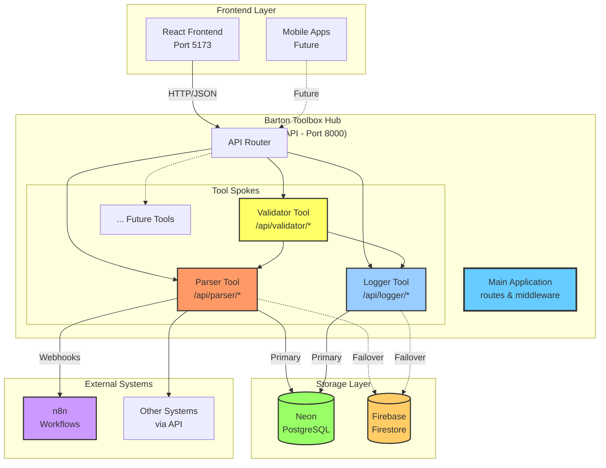
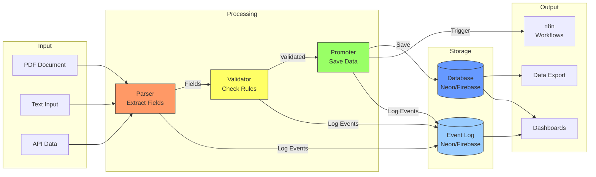
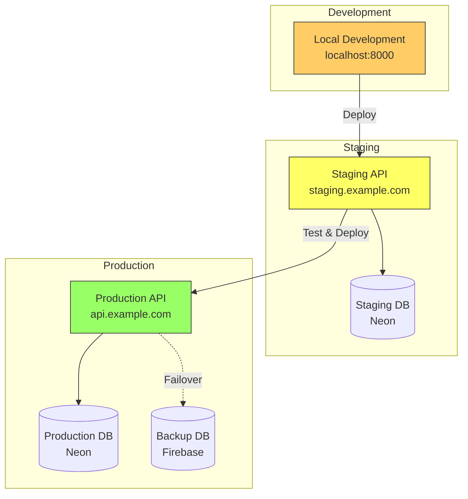
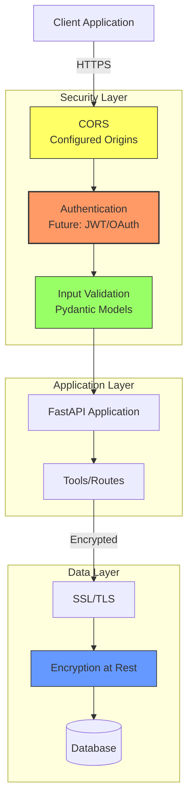

# System Architecture Diagram

This diagram shows the overall architecture of the Barton Toolbox Hub system.

## Hub-and-Spoke Architecture



## Component Details

### Frontend Layer
- **React Frontend:** User interface (Lovable.dev platform)
- **Mobile Apps:** Future mobile support
- **Communication:** HTTP/JSON REST API

### Hub Layer
- **Main Application:** Central coordinator
- **API Router:** Routes requests to appropriate tools
- **Tool Spokes:** Independent, self-contained tools

### Tool Spokes

#### Parser Tool
- **Purpose:** OCR and field extraction
- **Endpoints:** `/api/parser/*`
- **Dependencies:** Neon (primary), Firebase (failover), n8n

#### Validator Tool
- **Purpose:** Field validation
- **Endpoints:** `/api/validator/*`
- **Dependencies:** Parser (for field mappings), Logger

#### Logger Tool
- **Purpose:** Event logging and audit trail
- **Endpoints:** `/api/logger/*`
- **Dependencies:** Neon (primary), Firebase (failover)

### Storage Layer

#### Neon (PostgreSQL)
- **Role:** Primary database
- **Tables:**
  - `doc_parser_fillable` - Parsed documents
  - `doc_event_log` - Event audit trail
- **Features:** ACID compliance, SQL queries, indexes

#### Firebase (Firestore)
- **Role:** Failover storage
- **Collections:**
  - `doc_parser_fillable` - Document mirror
  - `doc_event_log` - Event mirror
- **Features:** Real-time sync, high availability

### External Systems

#### n8n
- **Role:** Workflow automation
- **Integration:** Webhook triggers
- **Use Cases:** Automated workflows, notifications, data sync

#### Other Systems
- **Integration:** REST API
- **Examples:** CRM, ERP, Data warehouses

## Data Flow Architecture



## Deployment Architecture



## Security Architecture



## Scalability Considerations

### Horizontal Scaling
- Deploy multiple instances behind load balancer
- Stateless design enables easy scaling
- Database connection pooling

### Vertical Scaling
- Increase CPU/RAM for parsing operations
- Optimize database queries
- Cache frequently accessed data

### Tool Independence
- Each tool can scale independently
- Deploy parser on more powerful instances
- Validator and logger can use smaller instances

## Tool Template Structure

```
/backend/tools/{tool_name}/
├── core/               ← Business logic
│   ├── {module}.py
│   └── __init__.py
├── schemas/            ← Validation schemas (optional)
├── sql/                ← Database schemas (reference)
├── tests/              ← Unit tests
├── routes.py           ← FastAPI endpoints
├── __init__.py
├── .env.example        ← Environment template
├── requirements.txt    ← Dependencies
└── README.md           ← Documentation
```

## Technology Stack

| Layer | Technology |
|-------|-----------|
| **Backend** | FastAPI (Python 3.11+) |
| **Database** | Neon (PostgreSQL) |
| **Failover DB** | Firebase (Firestore) |
| **Workflows** | n8n |
| **Frontend** | React + TypeScript + Vite |
| **UI Library** | Radix UI + shadcn/ui |
| **Styling** | Tailwind CSS |
| **State** | TanStack Query |
| **Validation** | Pydantic + Zod |
| **Testing** | pytest + jest |
| **Deployment** | Docker (future) |

## Communication Patterns

### Synchronous
- REST API calls between frontend and backend
- Tool-to-tool communication (e.g., Validator → Parser)

### Asynchronous
- Event logging (fire-and-forget)
- Webhook triggers (n8n)
- Background processing (future: Celery/Redis)

### Data Persistence
- Primary: Neon (ACID)
- Failover: Firebase (eventual consistency)
- Caching: In-memory (future: Redis)

---

**Generated with Claude Code**
**Maintainer:** Barton Toolbox Team
