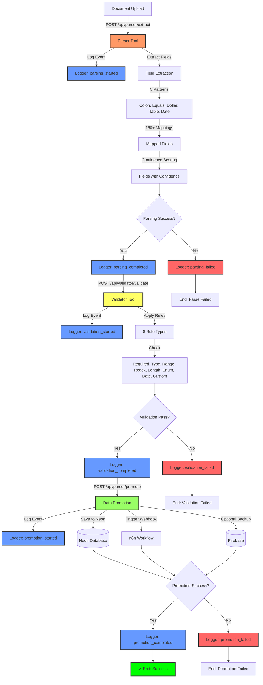

# Complete Document Processing Pipeline

This diagram shows the complete end-to-end flow for document processing in the Barton Toolbox Hub.

## Legend

- **Red Tools:** Parser (field extraction)
- **Yellow Tools:** Validator (validation)
- **Green Tools:** Promoter (data promotion)
- **Blue Logs:** Info/Success events
- **Red Logs:** Error/Failed events
- **Green Success:** Final success state

## Flow Steps

1. **Document Upload** → Start processing
2. **Parser Tool** → Extract fields from text
3. **Logger** → Track parsing events
4. **Validator Tool** → Validate extracted fields
5. **Logger** → Track validation events
6. **Data Promotion** → Save to external systems
7. **Logger** → Track promotion events
8. **Success/Failure** → Final state

## Key Decision Points

- **Parsing Success?** → Continue to validation or end
- **Validation Pass?** → Continue to promotion or end
- **Promotion Success?** → Success or end with error
